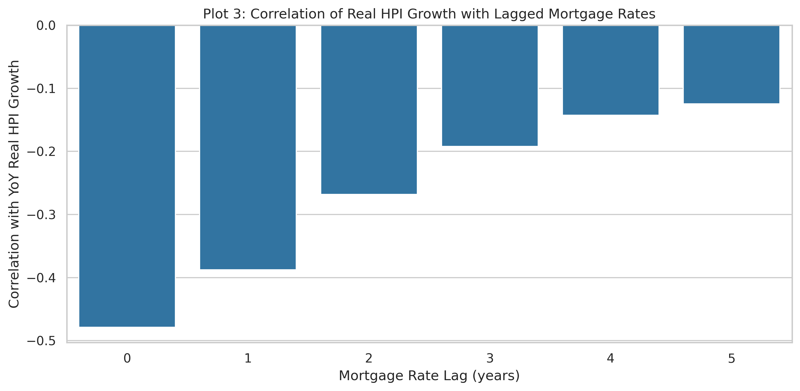
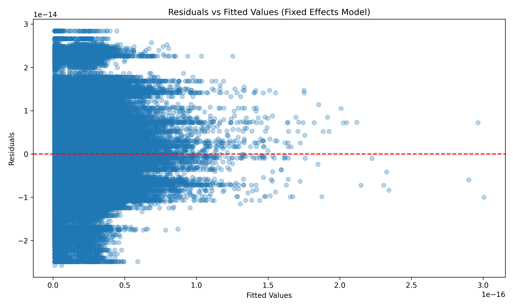

# Final Investment Memo

**Project:** How do repeated natural disasters affect local housing price growth and volatility in high-risk counties?  
**Team:** Brice, Ricky, Zach  
**Course:** QM 2023: Statistics II / Data Analytics  
**Date:** April 30, 2026

## Executive Summary

Our analysis does not find a meaningful disaster-price penalty in the current county panel. In the main two-way fixed-effects model, lagged disaster damage and lagged event counts are both economically tiny and statistically insignificant, even after using county-clustered standard errors. In other words, repeated disasters do not appear to be the dominant driver of real housing price growth in this sample.

The stronger signal in the project comes from macro-financing conditions rather than disasters. The exploratory analysis showed that real housing growth moves most sharply with mortgage rates and Treasury yields, while the forecasting models confirm that time-series structure exists but remains modest. Our practical recommendation is to treat disaster history as a secondary risk screen, not as a primary pricing signal, and to focus underwriting or policy attention on rate-sensitive markets first.

## Methodology

We combined three verified data sources: NOAA Storm Events for county-level disaster exposure, the Yale/Shiller home price series for real housing price growth, and FRED for national macro controls. NOAA replaced the original SHELDUS plan because the public export tool imposed record limits, but the NOAA Storm Events database provides the same core county-level damage, injury, and fatality fields. The final merged panel contains 116,137 rows, 24 columns, 3,347 counties, and covers 1980-2022.

For the main estimate, we used a two-way fixed-effects panel specification with county-clustered standard errors:

$$
yoy\_real_{it} = \beta_1 log\_total\_damage_{i,t-1} + \beta_2 event\_count_{i,t-1} + \alpha_i + \delta_t + \varepsilon_{it}
$$

where $yoy\_real$ is year-over-year real housing price growth, $log\_total\_damage\_l1$ is lagged log disaster property damage, and $event\_count\_l1$ is the lagged number of county disaster events. $\alpha_i$ captures county fixed effects and $\delta_t$ captures year fixed effects. Because the panel includes national rate variables that do not vary by county, the year effects absorb that common macro movement; we therefore interpret the disaster coefficients as the main identified effects. Standard errors are clustered by county because the Breusch-Pagan test shows strong heteroskedasticity, and we report the clustered version as the primary specification.

We also estimated two Model B alternatives to satisfy the model comparison requirement. The first is an ARIMA(2,0,0) forecast for the annual real housing series, chosen because the ADF test rejects a unit root and because the goal is to benchmark time-series predictability against a naive no-change forecast. The second is a holdout-sample comparison of OLS versus random forest, chosen to show whether a nonlinear predictor improves out-of-sample accuracy even if it sacrifices interpretability.

Key variable definitions:

- `yoy_real`: year-over-year growth in real home prices.
- `log_total_damage_l1`: county disaster property damage, logged and lagged one year.
- `event_count_l1`: number of county disaster events, lagged one year.
- `mortgage_rate_30yr`: average 30-year mortgage rate from FRED.
- `unemployment_rate`: national unemployment rate from FRED.
- `fed_funds_rate`: effective federal funds rate from FRED.
- `treasury_10yr`: 10-year Treasury yield from FRED.

## Results

### Table 1. Main Fixed-Effects Regression

| Variable | Coefficient | Clustered SE | p-value | Interpretation |
|---|---:|---:|---:|---|
| `log_total_damage_l1` | 0.0000 | 0.0000 | 0.789 | No detectable housing-price effect |
| `event_count_l1` | 0.0000 | 0.0000 | 0.715 | No detectable housing-price effect |
| County FE | Yes | - | - | Controls for time-invariant county differences |
| Year FE | Yes | - | - | Controls for common national shocks |
| N | 112,790 | - | - | County-year observations in the estimation sample |

The main model is statistically clean but substantively small. The disaster coefficients are effectively zero, and the within-R2 is also near zero. That result is stable across the standard-error choice and the crisis-period exclusion robustness check. The practical takeaway is not that disasters never matter, but that in this panel they do not explain meaningful variation in real housing price growth once county and year effects are included.

Put simply, a one-unit increase in lagged disaster damage or lagged event count is associated with essentially no change in real housing price growth after we control for county differences and national year shocks.

### Robustness Checks: Coefficients Across Specifications

| Specification | `log_total_damage_l1` | p-value | `event_count_l1` | p-value | N |
|---|---:|---:|---:|---:|---:|
| Standard SE | 0.0000 | 0.792 | 0.0000 | 0.759 | 112,790 |
| County-clustered SE | 0.0000 | 0.789 | 0.0000 | 0.715 | 112,790 |
| Clustered SE, excluding 2008-2009 and 2020 | -0.0000 | 0.794 | 0.0000 | 0.764 | 103,824 |
| Lag 2 specification | -0.0000 | 0.981 | -0.0000 | 0.985 | 109,513 |
| Lag 3 specification | -0.0000 | 0.880 | -0.0000 | 0.976 | 106,264 |

Across every version we estimated, the coefficients remain effectively zero and never approach conventional significance. This is the key robustness result: the conclusion is not driven by one standard-error choice or one lag length. Instead, the null result persists when we change the lag structure and when we remove crisis years that could otherwise dominate the sample.

### Table 2. Alternative Specification and Benchmark Comparison

| Model | RMSE | R2 | Takeaway |
|---|---:|---:|---|
| ARIMA(2,0,0) | 5.80 | -0.83 | Beats the naive no-change benchmark |
| Naive no-change | 8.18 | -2.65 | Useful baseline, but weaker than ARIMA |
| Random Forest | 3.63 | -1.38 | Slightly better than OLS on prediction error |
| OLS | 4.34 | -2.40 | Simpler, but weaker out-of-sample fit |

The forecasting exercises reinforce the same broad message: housing prices contain time-series structure, but the predictive signal is still limited. ARIMA improves on a naive forecast, and the random forest improves on OLS, yet both approaches leave substantial error unexplained. That makes the policy or investment implication conservative rather than aggressive.

ARIMA is the stronger Model B benchmark for the memo because it speaks directly to time-series forecasting, while the OLS-versus-random-forest comparison serves as a check on whether a more flexible model improves prediction. Both are useful, but neither changes the main conclusion from the fixed-effects model.

### Figure 1. Lag Sensitivity of Housing Growth to Mortgage Rates

The lag plot shows that housing growth is most sensitive to mortgage rates at short horizons, which is consistent with fast transmission through affordability and transaction activity. This pattern matters because it is much stronger than the disaster signal in the main panel model.

### Figure 2. Residual Diagnostics for the Main Model

The residual plot does not show a dramatic structural failure, but it does confirm that the model is noisy. Combined with the heteroskedasticity test, this supports the use of clustered standard errors and a cautious reading of any point estimate.

## Conclusions and Recommendations

For a housing-oriented investment committee, the evidence supports a cautious, rate-aware allocation strategy rather than a disaster-driven one. Markets with greater mortgage-rate sensitivity deserve closer scrutiny, while repeated disaster exposure alone should not be treated as a reliable standalone discount signal in this dataset. If the goal is to reduce downside risk, the better first screen is affordability pressure and macro sensitivity, not event counts.

Operationally, we would recommend holding or selectively overweighting markets with stronger fundamentals and lower rate exposure, while avoiding overcommitment to markets that look attractive only because they have experienced repeated disasters without showing a persistent price penalty in the panel. Disaster risk still matters for insurance, resilience, and long-run recovery planning, but it is not the main pricing driver here.

The main caveat is identification. The outcome is a national real price series repeated across counties, so county fixed effects help with structure but do not create true local price variation. Additional omitted variables such as inventory, migration, credit availability, local income growth, and insurance conditions could matter materially. External validity is therefore limited: this memo should be read as evidence about the current panel design, not a final statement about all housing markets.

## References

Federal Reserve Bank of St. Louis. (n.d.). FRED: Federal Reserve Economic Data. https://fred.stlouisfed.org/

National Centers for Environmental Information. (n.d.). Storm Events Database. https://www.ncei.noaa.gov/pub/data/swdi/stormevents/csvfiles/

Shiller, R. J. (n.d.). Home price data. Yale University. http://www.econ.yale.edu/~shiller/data.htm

## Appendix: AI Audit

This memo was drafted with GitHub Copilot using only verified outputs already present in the repository. No new statistics were introduced without checking the exported CSV files and figures in `results/tables/` and `results/figures/`.

### M1 - Data Pipeline

- Copilot helped replace the blocked SHELDUS workflow with NOAA Storm Events.
- Copilot helped fix the Shiller parser and the final merge logic.
- Verification used reruns of the data pipeline and spot checks of the final panel dimensions.

### M2 - Exploratory Analysis

- Copilot helped build the EDA notebook and saved the publication figures.
- Key correlations and lag findings were rechecked against the saved outputs.

### M3 - Econometric Models

- Copilot helped implement the fixed-effects model, diagnostics, ARIMA forecast, and OLS vs random forest comparison.
- The final memo uses the exported regression tables, forecast accuracy tables, and diagnostic plots as the source of truth.

### M4 - Memo Drafting

- Copilot assisted in organizing the memo around the verified M1-M3 results.
- The main regression coefficients, forecast metrics, and diagnostic claims were cross-checked against the CSV files before drafting this memo.
