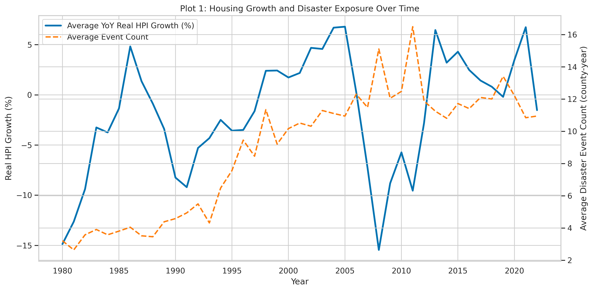
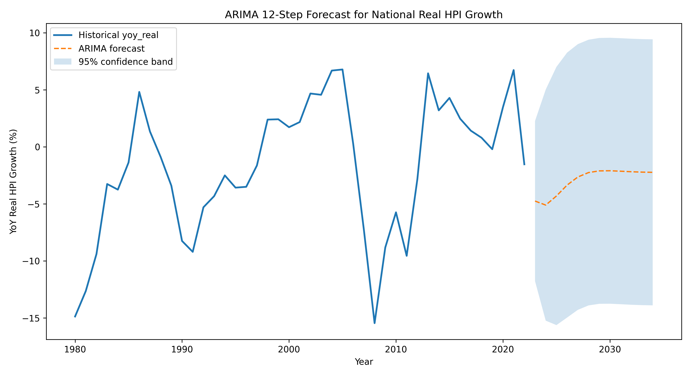
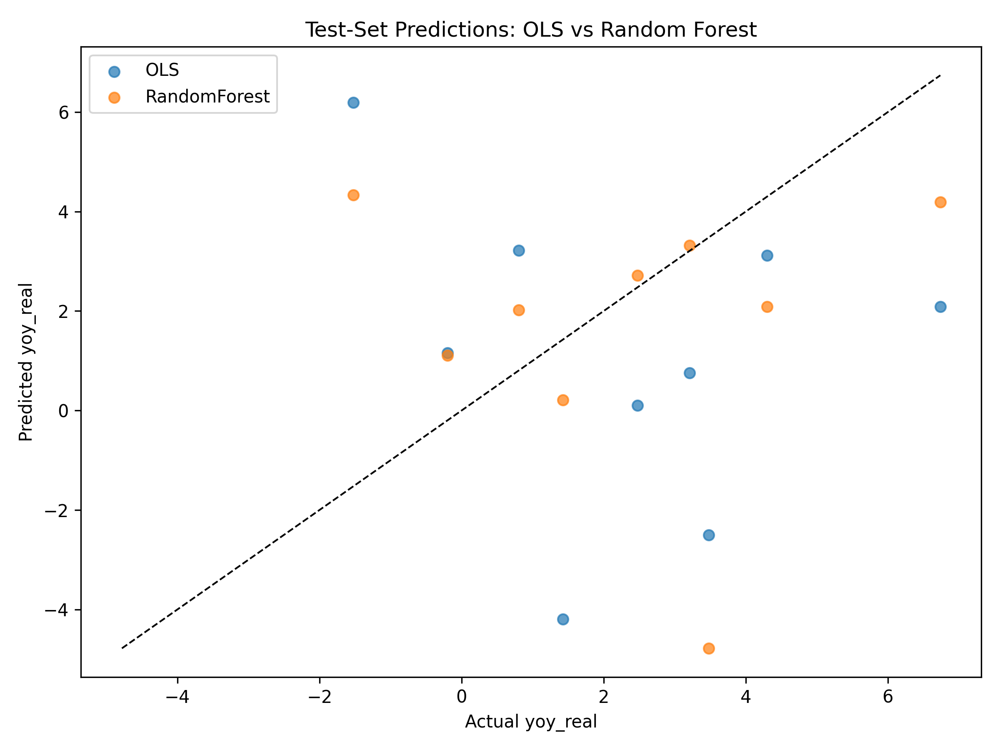

# QM 2023 Capstone Project: Milestone 4 Presentation (Visual Focus)

---

## Slide 1: Title
- How do repeated natural disasters affect local housing price growth and volatility in high-risk counties?
- Team: Brice, Ricky, Zach

---

## Slide 2: Key Finding (Visual)
- Main result: Disasters have little effect on housing price growth.

---

## Slide 3: Macro Drivers Dominate
- Mortgage rates and macro factors matter more than disasters.

---

## Slide 4: Model Diagnostics
- Model is statistically clean but noisy.

---

## Slide 5: Forecasting Results
- ARIMA and ML models improve prediction, but error remains.

---

## Slide 6: Machine Learning Comparison
- Random forest vs OLS: ML is slightly better.

---

## Slide 7: Summary & Recommendation
- Focus on rate-sensitive markets, not disaster history.
- Use disaster as a secondary risk screen.

---

## Slide 8: Q&A
- Questions?
